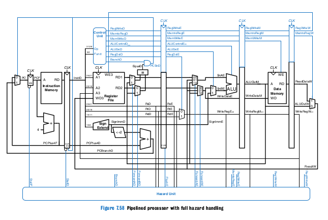

# RISC-V verilog model

Base on book "Digital Design and Computer Architecture" chapter 7



# Requirements
[verilator](https://www.veripool.org/verilator/) and [ELFIO](https://github.com/serge1/ELFIO)

Optionally [gtkwave](https://gtkwave.sourceforge.net/)

# Usage
```bash
mkdir build && cd build
cmake ..
make
./Vtop <path-to-riscv-executable>
```
Only rv32i instructions are supported. 